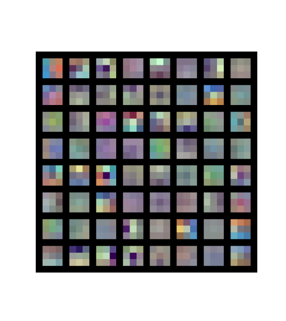
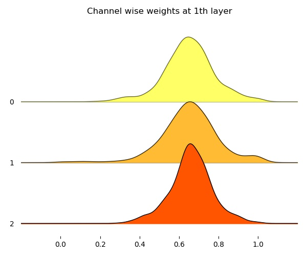
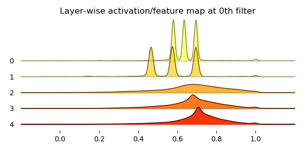

## Visualizing VGG-16 ##

Visualizing the weights and feature/activation maps of a pretrained VGG-16

### Dependencies ###

refer [requirements.txt](requirements.txt) 

### Implementation  ###

1) For visualizing weights, I started with [this](https://github.com/pedrodiamel/nettutorial/blob/master/pytorch/pytorch_visualization.ipynb) [1].

* The layerwise weights are visualized [here](results/weights). Weights at first Convolution layer look like this

* The numpy arrays were also saved and plotted as stacks of histograms. The three channels at the first layer produce the following histogram. 

2) For Visualizing activations/features, I used the [guided backprop method](https://github.com/utkuozbulak/pytorch-cnn-visualizations#convolutional-neural-network-filter-visualization) [2].

* The feature map at layer 1 and filter 0 on an [example image]() looks 

* Here the histograms produced were layerwise, to compare how a filter is activated across different layers.

 

### References ###

[1] https://github.com/pedrodiamel/nettutorial/blob/master/pytorch/pytorch_visualization.ipynb

[2] https://github.com/utkuozbulak/pytorch-cnn-visualizations#convolutional-neural-network-filter-visualization

